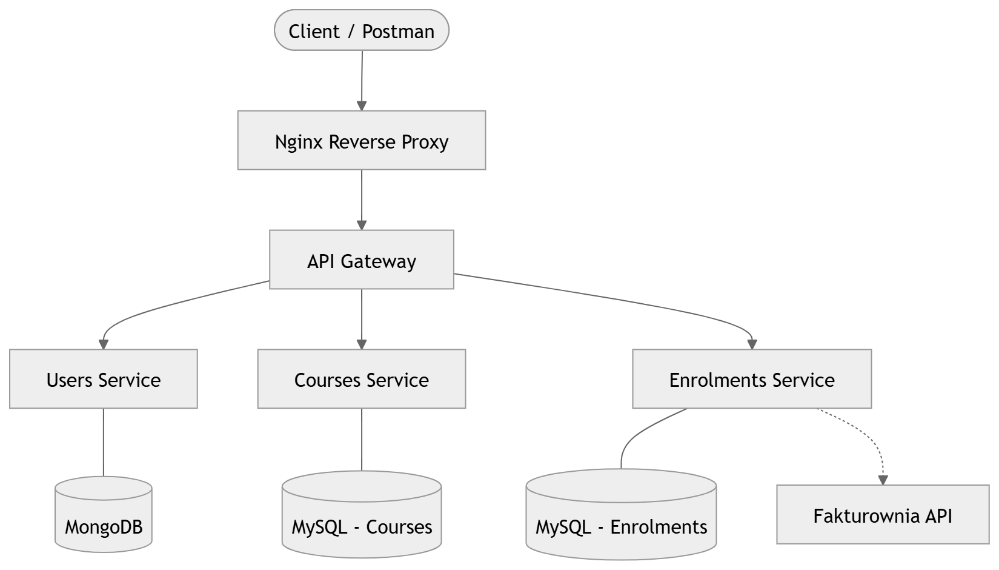

# 🚀 Course Platform – Microservices Architecture

[](https://www.python.org/)
[](https://flask.palletsprojects.com/)
[](https://www.docker.com/)
[](#)
[](https://opensource.org/licenses/MIT)

## 📖 Overview

Course Platform is a production-ready, microservices system designed for scalable course and enrolment management.
The architecture demonstrates modern backend engineering practices including:

* Centralized **API Gateway**
* **JWT-based authentication** with MFA
* Strict **service isolation**
* Independent **databases per service** (MongoDB for Users, MySQL for Courses and Enrolments)
* Fully **containerized infrastructure** using Docker Compose
* **100% automated test coverage** for all microservices

The project is fully containerized using Docker Compose and designed with horizontal scalability and service independence in mind.

---
## 🏗️ Architecture Overview
* The system follows a database-per-service pattern with centralized authentication and routing handled by the API Gateway.

 

* **Independent microservices** with strict database ownership  
* **Centralized authentication & authorization**  
* **Service-to-service communication** via HTTPX  
* **Stateless services** (JWT-based authentication)
---
## ✨ Technical Highlights & Engineering Decisions
### 🔐 Security First

* JWT authentication (access + refresh tokens)
* HTTP-only cookie storage for refresh tokens
* Role-Based Access Control (admin / user)
* Multi-Factor Authentication (TOTP)
* Centralized rate limiting at Gateway level
---
## ⚡ Performance & Concurrency

* Non-blocking service-to-service communication using **HTTPX**
* **ThreadPoolExecutor** used for non-blocking paid status updates
* Optimized database indexing for lookup-heavy endpoints
* Dedicated database per service to eliminate cross-service contention
---
## 🧱 Clean Architecture & Maintainability

Clear separation of layers:

* **API layer**
* **Service layer**
* **Infrastructure layer**

Additional best practices:

* Dependency Injection container (**Dependency Injector**)
* **Pydantic** validation for request/response schemas
* Strict environment-based configuration 
---
## 💻 Tech Stack

### **Backend**
* **Python 3.13**
* **Flask**
* **Flask-JWT-Extended**
* **Flask-Migrate**
* **Flask-Mail**
* **Flask-Limiter**
* **HTTPX**
* **Dependency Injector**
* **Pydantic**

### **Databases**
* **MongoDB** (Users Service)
* **MySQL** (Courses & Enrolments Services)

### **Infrastructure**
* **Docker**
* **Docker Compose**
* **Nginx** (Reverse Proxy)

### **External Integration**
* **Fakturownia API** (billing / invoice generation)

---
## 🧪 Testing Strategy & Quality Assurance

The platform follows a robust **testing pyramid**, emphasizing reliability, isolation, and maintainability:

* **Unit Testing & Mocking:**  
  * `pytest` is used for all unit tests.  
  * `unittest.mock.MagicMock` provides mocks for dependencies and external services, ensuring tests remain isolated.

* **Integration Testing:**  
  * Each microservice has an isolated database (MongoDB for Users, MySQL for Courses/Enrolments).  
  * Ephemeral test databases can be spun up during tests to guarantee environment consistency.

* **End-to-End Smoke Tests:**  
  * Lightweight E2E tests verify core workflows across microservices (e.g., user creation → course enrolment → invoice generation).

* **Continuous Integration & Coverage:**  
  * `pytest --cov` ensures **100% coverage** for all microservices.  
  * Tests run in isolated CI environments to prevent flaky or environment-dependent failures.

* **Deterministic & Repeatable:**  
  * Test fixtures reset database state for each test.  
  * Environment variables are isolated per test to prevent cross-test contamination.

---
## 🛡️ Dev Practices & Engineering Discipline

* **Environment variables** isolated in `.env`  
* **Production & development Dockerfiles** separated  
* **Centralized logging** per service  
* **Health check endpoints** per microservice  
* **Strict separation** of development and production configuration  

---

## 📊 Observability & Health

Each service exposes:  
* **Health check endpoints**  
* **Structured error responses**  
* **Explicit error handling** for authentication and authorization failures  
* **Rate limiting** protects the API Gateway against abuse and brute-force attacks  

---


## 🚀 Getting Started (Local Development)

### Prerequisites
* **Docker & Docker Compose v2+**
* **Python 3.13+**


### 1. Environment Configuration
* **Copy .env.example to .env and adjust values:** 

```bash
cp .env.example .env
```

### 2. Start the Platform

* **Build and run all services:**
```bash
docker-compose up -d --build
```

* **Check logs:**
```bash
docker-compose logs -f api-gateway-webapp
docker-compose logs -f users-webapp
docker-compose logs -f courses-webapp
docker-compose logs -f enrolments-webapp
```

### 3. Check Endpoints
You can test the endpoints using Postman. For **request examples** per microservice:

### Create User
* **Request** (**POST** **http://localhost/api/users**):
* **body**
```JSON
{
  "username": "johndoe",
  "first_name": "John",
  "last_name": "Doe",
  "email": "john@example.com",
  "password": "Password1!",
  "password_confirmation": "Password1!",
  "gender": "Male",
  "role": "user"
}
```
* **Response** (201 Created):
```JSON
{
  "id": "63a1f1234abc5678def12345",
  "username": "johndoe",
  "first_name": "John",
  "last_name": "Doe",
  "email": "john@example.com",
  "gender": "Male",
  "role": "user",
  "is_active": false
}
```

---
## 📂 Project Structure
```text
course-platform/
├── api-gateway/
│   ├── webapp/
│   │   ├── api/
│   │   ├── services/
│   │   ├── container.py
│   │   ├── settings.py
│   │   ├── extensions.py
│   │   └── app.py
│   └── Dockerfile
├── users/
│   ├── webapp/
│   ├── tests/
│   └── Dockerfile
├── courses/
│   ├── webapp/
│   ├── tests/
│   └── Dockerfile
├── enrolments/
│   ├── webapp/
│   ├── tests/
│   └── Dockerfile
├── nginx/
│   └── default.conf
├── docker-compose.yml
├── .env
└── README.md
```
---
### 🤝 Contact

* Designed and implemented by Damian Kowalczyk.
Feel free to connect or explore other backend projects.